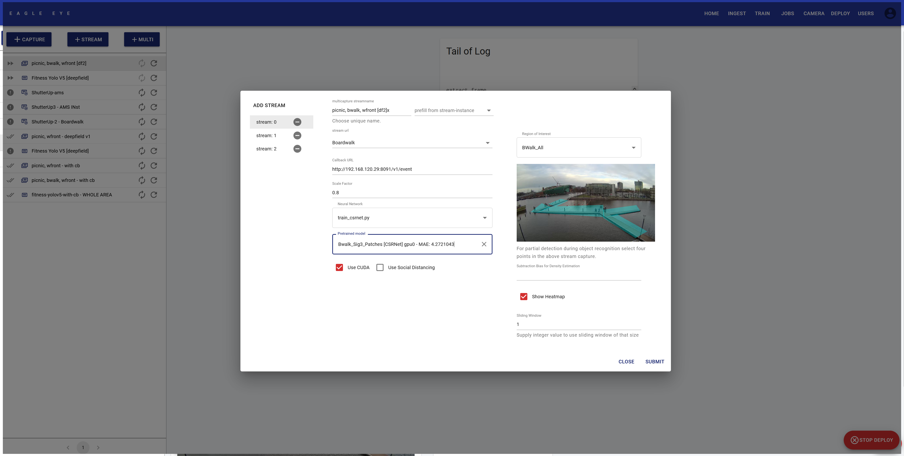
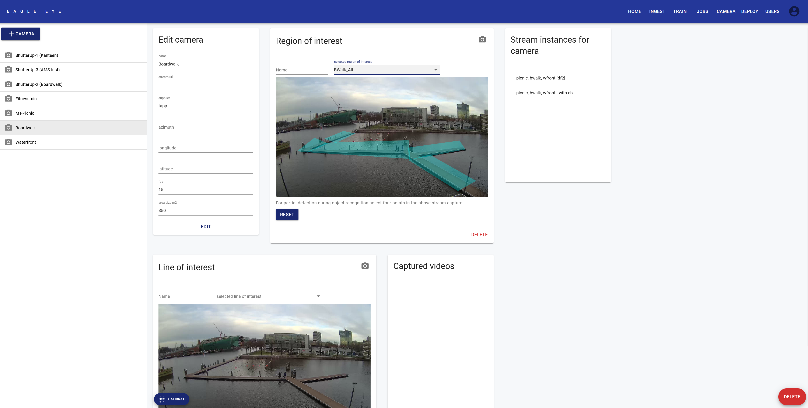
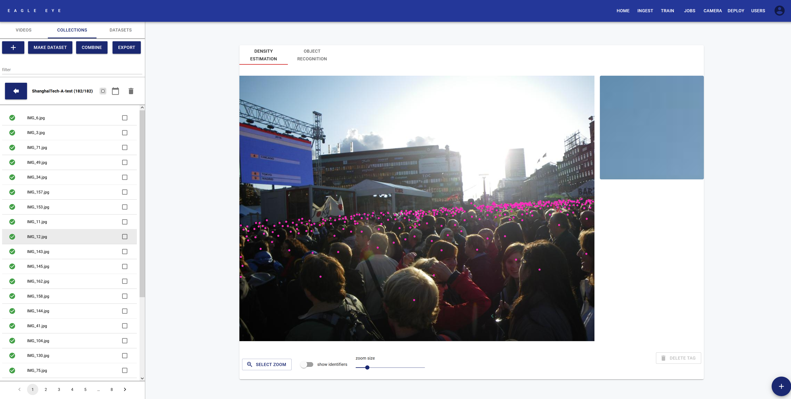

# What's Public Eye

Public Eye is a multi-platform end-to-end Crowd Counting System based on Deep Learning. It packs the whole end to end Machine Learning Stack from Data collection, to Image Tagging, to Training, to Deployment into an intuitive software solution. Public Eye connects easily with RTSP camera streams and its just a matter of clicks to deploy a Machine Learning model and yield some insights. 

This repo comes out-of-the-box with a pretrained ViCCT transformer network allowing for rapid deployment within few minutes. 

Public-Eye is currently deployed on multiple areas in the City of Amsterdam, providing key-insights to policy makers and government. This repository is being maintained by the CTO office of Amsterdam in cooperation with LIFE Electronic and Tapp.

For more information, please visit:

- [Public Eye - Crowd Counting Overview](https://www.tapp.nl/projects/public-eye)
- [Public Eye Official Statement City of Amsterdam](https://www.amsterdam.nl/innovatie/mobiliteit/public-eye/)
- [Algorithm register City of Amsterdam (Dutch)](https://algoritmeregister.amsterdam.nl/public-eye/)

## Features of Public Eye

- State of the Art performance that outperformes blackbox software of commercial vendors
- Fully functional Web-UI that simplifies all the tedious tasks
- Integrates with every RTSP camera in a matter of minutes
- Pre-trained ViCCT Transformer for "out of the box deployment"
- Pre-trained Yolov5 based Social Distancing feature
- Pre-trained LoID algorithm for Counting Line Crossings and Directions
- Multiple user-defined Regions-of-Interests per camera
- HTTP(s) Webhooks to integrate with your ESB or Data brokers
- Integrated manual with explanations for each section of the UI
- User control management system with fine-grained permission system
- Data management system for video and image data
- Intuitive tagging system for rapid dataset creation
- Experiment framework for keeping tracks of training sessions and outcomes
- Model database
- Fully Open-Source (duh.. it's are on Github after all :-))
- ... and more

## Some cool images

Hereby some images of the UI so that you get a feel of what PE 'looks like'

### Deployment View

The deployment view is for actual deployment of a network on a camera stream.

### Camera View

The camera view allows users to manage all aspects related to cameras. 

### Tagging View

This view is specialied for dataset creation. Users can tag images that then can be used for training in order to fine-tune the algorithms.

## Getting started and Documentation

### Installation

Download the repository and **carefully** follow the instructions in `install/INSTALL.md`. The system has been tested on Ubuntu and Windows 10.

### Documentation

Public Eye comes with an extensive documentation integrated into the UI. 

## Getting involved

Public Eye is an on-going project and we are always looking for contributors who want to join the effort. Our mission is to create great software that helps collecting insights on crowds in an ethical manner. If you are interested, please reach out to Markus Pfundstein (markus (at) life-electronic (point) nl) or through Github.

## Contributors

- Markus Pfundstein (Lead Developer, Active)
- Joeri Sleegers (Full-Stack Developer, Active))
- Tom van Arman (Product Owner, Active)
- Daan Groening (Management & Support, Active)
- Boen Groothoff (Management & Support, Active)
- Jan-Erik van Woerden (LoiD Line Crossing algorithm)
- Lando de Weerdt (ViCCT Transformer)
- Thomas Jongstra (ML Support)

## Additional contributions

Additional contribuations have been made by:

- Eelco Thiellier
- Maarten Sukel
- Richard Drewes
- Aurore Paligot

...and many more.

## License

Public Eye has a whole is licensed under the [GNU General Public License v3.0](https://www.gnu.org/licenses/gpl-3.0.nl.html) (see licenses/GPLv3_license.txt). Integrated software might have been released under different licenses. Please see the `README` files in the corresponding directories and/or in the code of the software. Software written by the Public Eye Team itself is co-licenses under the [EUPL V1.2](https://joinup.ec.europa.eu/sites/default/files/custom-page/attachment/2020-03/EUPL-1.2%20EN.txt) license (see licenses/EUPL-1.2_license.txt).