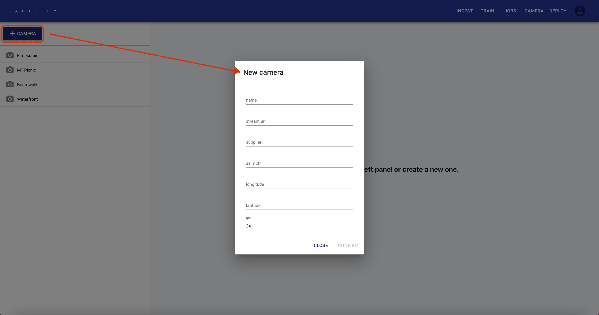
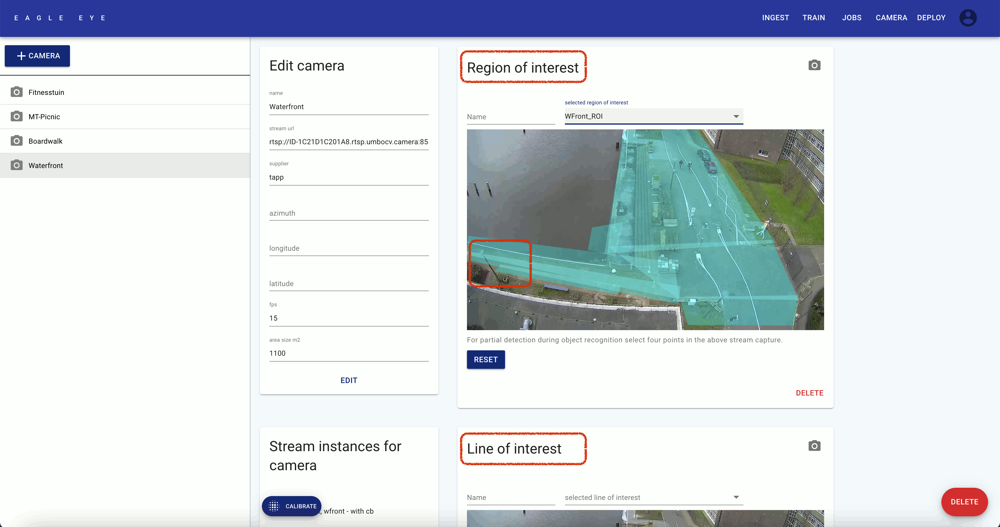

# Camera Page

---

### What can be done here?

- [Add New Camera](#add-new-camera)
- [Manage Cameras](#manage-cameras)

---

## **Add New Camera** 

- Click on the **[+ CAMERA button]** 
- Insert all camera details in the pop-up window, and press **CONFIRM**.
- After adding the camera, you can go to the [Deploy Page](../deploy) to capture an image collection.

**Example Video:**

<video width="800" height="450" controls>
  <source src="../markdowns/videos/Task 1_1 - Add a Camera to the System.mp4" type="video/mp4">
</video>

## **Manage Cameras** 

- Select a camera in the left panel.
- In the **Edit camera** box, you can modify camera details.
- In the **Region of interest** box, you can **review** and **define** Region of Interest (ROI) definitions.
  - Click the **[Camera Icon]** to refresh the camera image.
  - **Review ROI's:**
    - Select with the dropdown menu.
    - Refresh the page, in case you want to add a new ROI after reviewing ROI's.
  - **Add new ROI:**
    - You can draw boxes on the image by clicking 4 times on the image.
    - Draw multiple boxes to cover all areas you are interested in.
    - (Press **RESET** to remove all boxes, when you want to start over.)
    - When you are done, enter a **Name** for you ROI, and press **SUBMIT**.
- In the **Region of interest** box, you can **review** and **define** Region of Interest (ROI) definitions.
  - This is similar to the Region of Interest review/define process above, except that you draw crossing-lines by clicking 2 times on the image (instead of 4 times for a box).
- A camera definition can be deleted by clicking the **[red DELETE button]** at the bottom right of the screen. This operation is permanent.

**Example Video:**

<video width="800" height="450" controls>
  <source src="../markdowns/videos/Task 4_1 - Create a Region of Interest.mp4" type="video/mp4">
</video>

---

