# Ingest Page

---

### What can be done here?

- [Tag Images](#tag-images)
- [Manage Content](#manage-content) (videos, image collections, datasets)
  - [Upload a video](#upload-a-video)
  - [Delete/rename a video](#delete/rename-a-video)
  - [Create an image collection from a video](#create-an-image-collection-from-a-video)
  - [Create an image collection from existing images](#create-an-image-collection-from-a-existing-images)
  - [Combine image collections](#combine-image-collections)
  - [Curate an image collection](#curate-an-image-collection)
  - [Export an image collection](#export-an-image-collection)
  - [Create a dataset from an image collection](#create-a-dataset-from-an-image-collection)
  - [Split a dataset](#split-a-dataset)

---

## Tag Images 

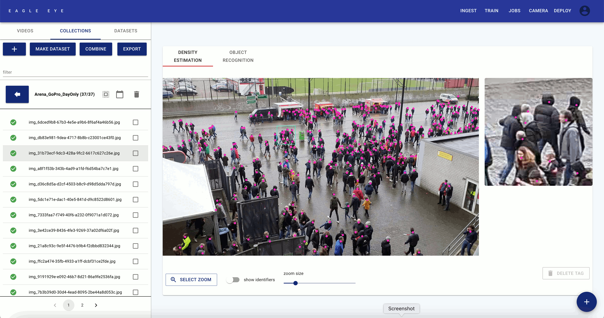

**Preparation**

To tag images, we need an image collection. You can add a camera on the [Camera Page](../camera), and capture a video using this camera on the [Deploy Page](../deploy). In the [Video Section](../ingest/videos) of this page you can create an image collection from a video.

**Workflow**

When tagging an image collection, we advice perform 1 initial "pass" through the entire collection, in which all images are tagged. Afterwards, we advise using 2 evaluation "passes" (ideally by 2 different people) who check all the initial tags, and who ensure that there are no faulty tags (missed/incorrect/double/etc.).

**Best Practices**

We advice to have well-trained and meticulous employees to perform the image tagging and evaluation passes. The performance of the trained AI models will be highly influenced by the accuracy of the created image tags.

**Tagging Policy**

We have devised a tagging policy for head-tagging. These "Gold Standards" should be adhered to when tagging new head-tagging image collections.

**Gold Standards for Head-Tagging**

See the table below with example images of situations that are often seen as ambiguous by taggers. For each image we add an observation for this image, and a solution of how to handle such a situation during tagging.

| #    | Image                                                        | Observation                                                  | Solution                                                     |
| ---- | ------------------------------------------------------------ | ------------------------------------------------------------ | :----------------------------------------------------------- |
| 1    |  | A person’s body is visible, but their head is NOT visible (it is outside of the screen, or fully obfuscated by an object in the scene, like a pillar or a statue). | NO tag should be created for this person.                    |
| 2    |  | A person’s head is **partially** visible (e.g. because another person’s head or an object is partially in front of it).**Solution:** | Tag the location where the centerpoint of their head would be, even if this centerpoint does not fall on a visible part of their head. |
| 3    | 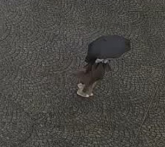 | A person is hidden behind an umbrella.                       | A tag should be created for this person, on the location where the centerpoint of their head is expected to be. |
| 4    |  | TWO OR MORE people are hidden behind an umbrella.            | A tag should be created for these people, on the locations where the centerpoint of their heads are expected to be. |
| 5    | 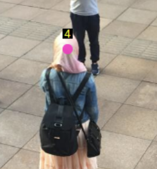 | A person’s head is not visible due to relatively common street gear (hat/cap/scarf/headscarf/niqab/mouth mask/burqa). | Tag the location where you expect the centerpoint of the person’s head to be. |
| 6    | 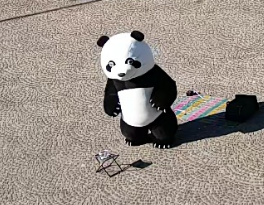 | A person’s head is not visible due to wearing street performer gear (mascotte-suit/full body paint/living-statue arrite). | NO tag should be created for this person.                    |
| 7    |  | A person is very far away, but I’m certain it is a person.   | Tag the centerpoint of their head.                           |
| 8    |  | A person is very far away. I’m NOT SURE it’s a person though... | Place an “uncertain” tag on the centerpoint of their might-be head. |
| 9    | 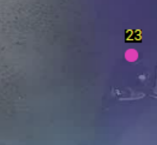 | There is something person-like visible in the image. It might actually be a person, but I’m NOT sure (i.e. due image noise, lens flare, water drops on the lens, image fuzziness, etc.). | NO tag should be created for this possible person.           |
| 10   | 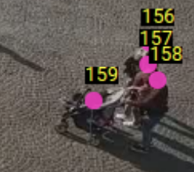 | There is a baby cart visible, and I can see the baby’s head. | Place a tag on the centerpoint of the baby’s head.           |
| 11   | 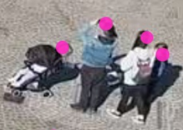 | There is a baby cart visible, but I **can’t** see the baby’s head. | NO tag should be created.                                    |
| 12   | 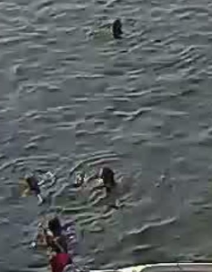 | There is someone swimming in the water, next to the boardwalk that we are interested in. | Tag the centerpoint of the swimming person’s head.           |
| 13   | 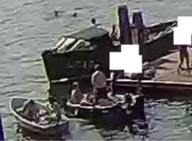 | There is someone on a boat, next to the boardwalk that we are interested in. | Tag the centerpoint of the person’s head.                    |
| 14   | 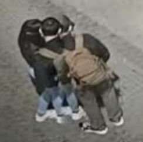 | A person’s head seems to be “split”, and appears “twice”.    | This is likely caused by faulty image stitching. Place a single tag on the centerpoint of the most complete "head-split" |
| 15   | 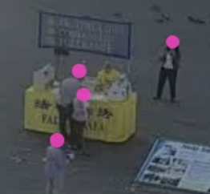 | A person is visible behind a translucent object (a banner, fishnet, tree branch, etc.). | Tag the centerpoint of the person’s head.                    |
| 16   | 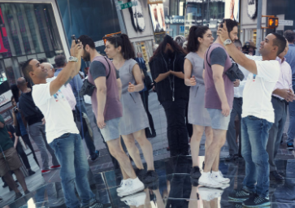 | A person is visible by means of a reflective surface (e.g. mirror, window, water surface). | NO tag should be created for this person’s reflection.       |
| 17   |  | A person’s image is visible on a poster.                     | NO tags should be created for this poster.                   |
| 18   |  | A statue of a person or clothing-mannequin is visible.       | NO tag should be created for the statue/mannequin.           |
| 19   |  | People are sitting still at a cafe.                          | Tag the centerpoints of the people’s heads.                  |
| 20   | 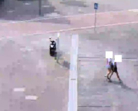 | The image quality is bad / much lower than normal. Should I even create tags? | Tag the centerpoints of the people’s heads. **Also**, please write down the number of the image that this occurred with, and pass this information to the quality evaluation team and the developers. |
| 21   |  | A hunched-over person, whose head is not visible.            | Tag the centerpoint of where you expect the head of this person to be. |

**Start Tagging**

- Go to the **COLLECTIONS** section.
- Find the the image collection that you want to tag in the left panel.
- Double-click on the image collection to open it.
- Select an individual image in the left panel.
- Click on the **[SELECT ZOOM button]**, and then click on a part of the screen where you see people.
- Click on the center of the head of people to create pink head-tags. (refer to our gold tagging standards!)
- Incorrect tags can be selected (they turn green when selected), and deleted by clicking the **[DELETE TAG button]**.
- When all heads are tagged, an image can be **set to finished** by clicking the light-green checkmark left of the image name in the left panel; or by hovering over the **[blue plus button]** on the bottom right, and selecting the **[grey checkmark button]**.
- You can now continue with the next image!

(**NB**: Images that are **set to finished** cannot be tagged anymore, unless they are **set to unfinished** again.)

**Example Video:**

<video width="800" height="450" controls>
  <source src="../markdowns/videos/Task 2_1 - Tag an Image Collection.mp4" type="video/mp4">
</video>

---

## Manage Content 

### Upload a video 

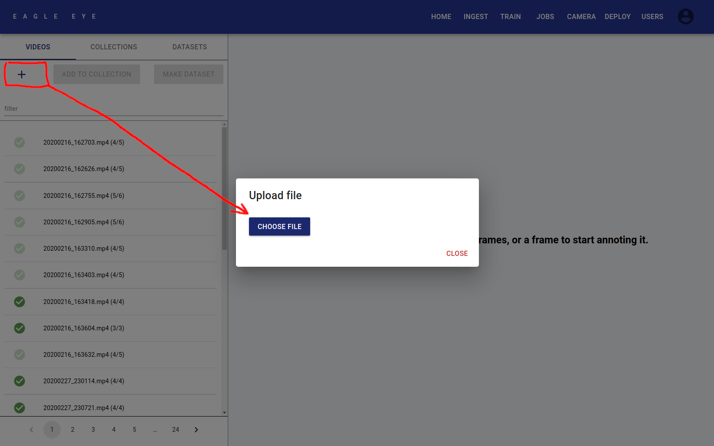

- Click the **[PLUS button]** on the top left.
- Click the **[Choose File button]** in the pop-up window.
- Select the file you want to upload.
- The upload should now start.

### Delete/rename a video 

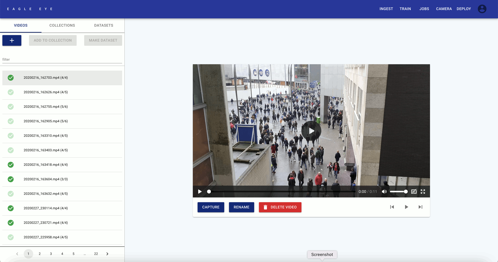

- Go to the **VIDEOS** section.
- Select a video (single-click) in the left panel.
  - The filter-textbox can be used to search.
- Click on the **[blue RENAME button]**.
- Write down a new name in the pop-up windows, and finish by clicking on **RENAME** in the pop-up window.

### Create an image collection from a video 

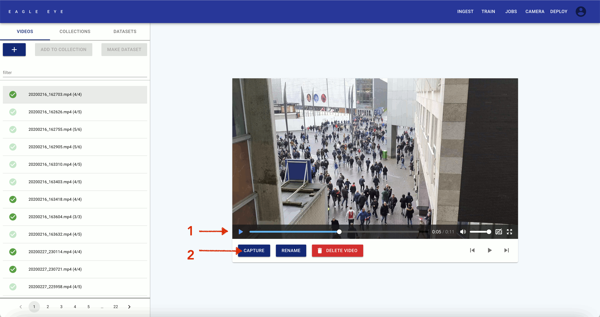

- Go to the **VIDEOS** section.
- Select a video (single-click) in the left panel.
- Play through the video to find good frames.
- Click on the blue **CAPTURE** button to capture such a frame.
- The video can be double-clicked in the list on the left, to show all captured frames.

### Create an image collection from existing images 

- Go to the **COLLECTIONS** section.
- Press the **[blue PLUS button]**.
- Insert a name for your new image collection, and click **AGREE**.
- Now the new collection is created.
- To add an image to the new collection:
    1. Double-click on an existing collection to go into it.
    2. Select an image from this collection in the left panel.
    3. Hover over the **[round blue PLUS button]** in the bottom right of the screen.
    4. Click the **[round grey PLUS button]** that has appeared.
    5. In the pop-up window, select the new collection you created.
    6. Click the **ADD** button to close the pop-up window.
    7. The image is now added to the collection.

### Combine image collections 

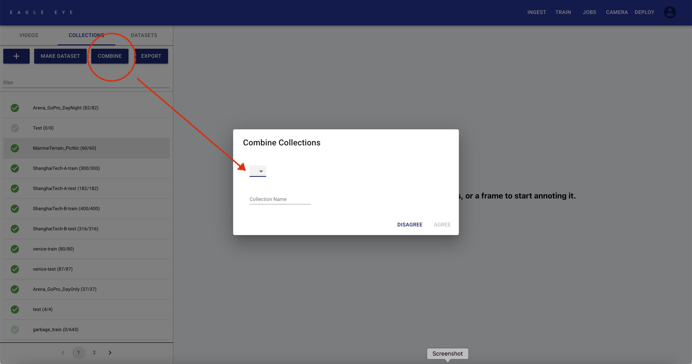

- Go to the **COLLECTIONS** section.
- Select an image collection that you want to combine with another one (single-click it in the left panel.
- Click on the blue **[COMBINE button]**.
- In the drop-down list, select the collection that you want to combine with.
- Write down a new Collection Name in the textbox.
- Click **AGREE** to create the new combined image collection.
- The new collection should become available in the left panel.

### Curate an image collection 

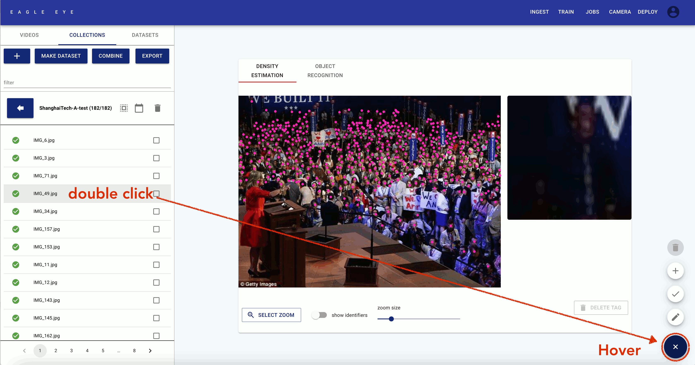

When you have a large image collection, you may want to curate it.

- Go to the **COLLECTIONS** section.

- Go into an image collection (double-click it in the left panel).
- Select an image in the left panel.
- Hover over the **[blue round PLUS button]** on the bottom right of the screen.
  - Here, the image can be:
    - Renamed
    - Set to finished/unfinished (indication of whether tagging is done)
    - Added to another collection
    - Deleted (only possible when set to unfinished)

**Example Video:**

<video width="800" height="450" controls>
  <source src="../markdowns/videos/Task 1_3 - Create a Curated Image Collection.mp4" type="video/mp4">
</video>

### Export an image collection 

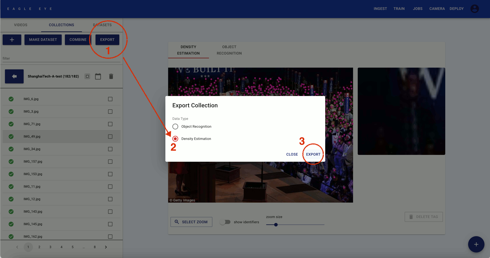

- Go to the **COLLECTIONS** section.
- Select an image collection (single-click it in the left panel).
- Click the blue **EXPORT** button.
- Choose data type: **Density Estimation**.
- Click on **EXPORT** to download the collection and its annotations.

### Create a dataset from an image collection 

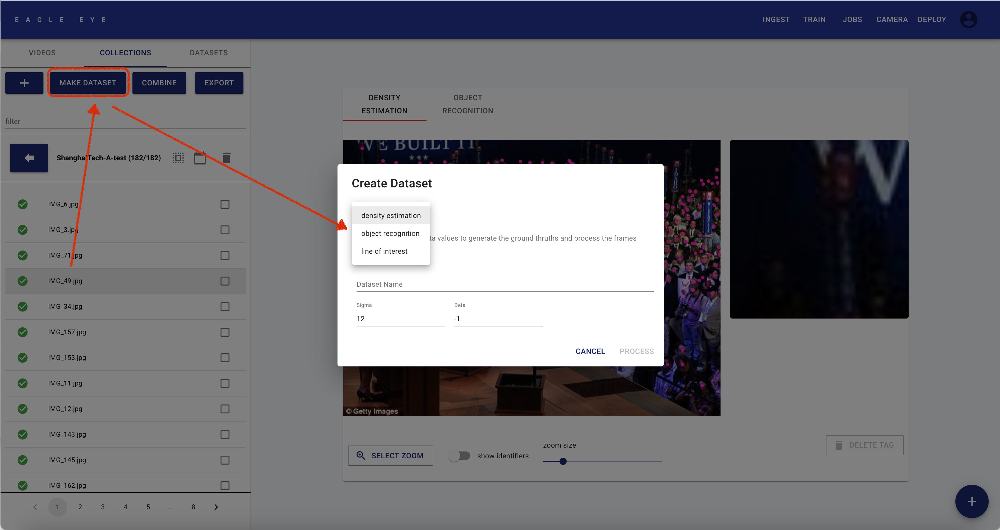

- Go to the **COLLECTIONS** section.
- Select an image collection  (single-click it in the left panel).
- Click the **[blue MAKE DATSET button]**.
- To create a head-tag dataset, choose **density estimation** in the dropdown menu.
  - We suggest to use **Sigma=5** and **Beta=-1**
- To create a Line Of Interest dataset, choose **line of interest** in the dropdown menu.
  - We suggest to use **Delta=0.1**.
  - Set the slider to **video collection** when the images are captured from a video-file within Public Eye.
- Choose a good **Dataset Name**, and click PROCESS to create the dataset.
- After the processing is done, the dataset can be found in the **DATASETS** section.

**Example Video:**

<video width="800" height="450" controls>
  <source src="../markdowns/videos/Task 3_1 - Create a Dataset.mp4" type="video/mp4">
</video>

### Split a dataset 

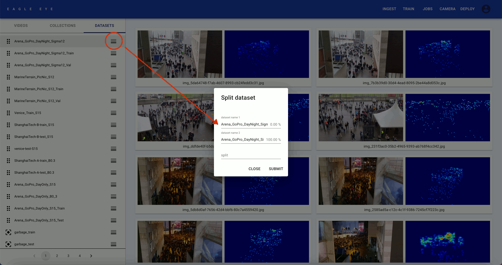

- Go to the **DATASETS** section.
- Find the dataset that you want to split in the left panel
  - There is no dataset-search available atm.
  - The numbers at the bottom can be used to navigate the list.
- After finding the dataset that you want to split, slick on the **[grey icon to the right of it (three horizontal bars)]**.
- Choose names for your dataset splits. By default, the names are set to the originale name, prepended by **_TRAIN** and **_VAL**. The split ratio can be set between 0 and 1.
- Press **SUBMIT** to create the two new sets.

**Example Video:**

<video width="800" height="450" controls>
  <source src="../markdowns/videos/Task 3_2 - Split a Dataset.mp4" type="video/mp4">
</video>

---