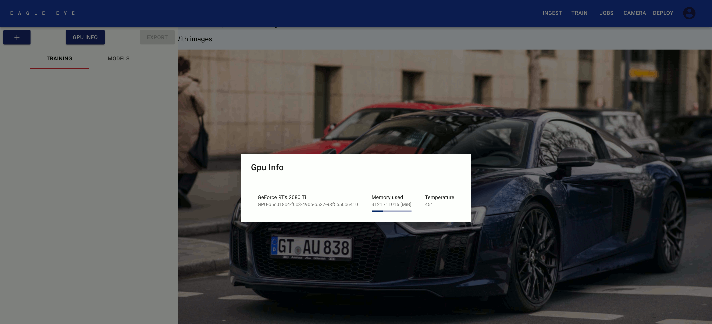
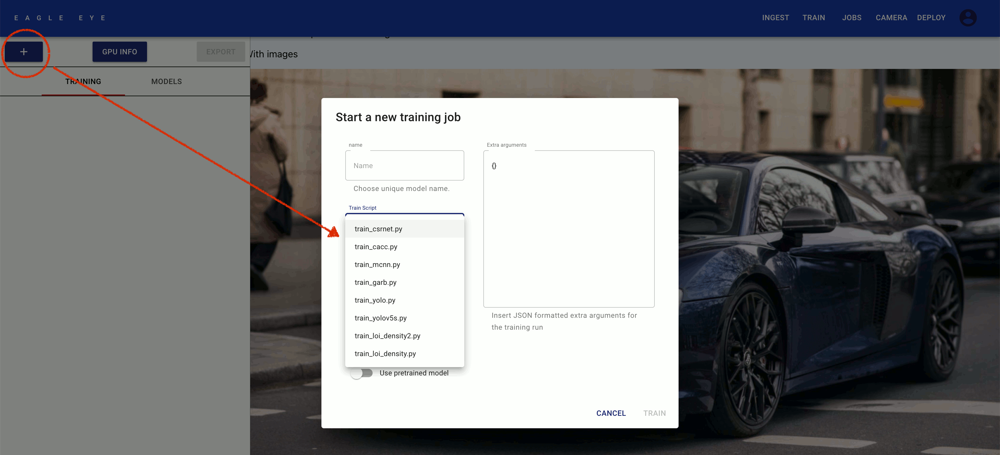
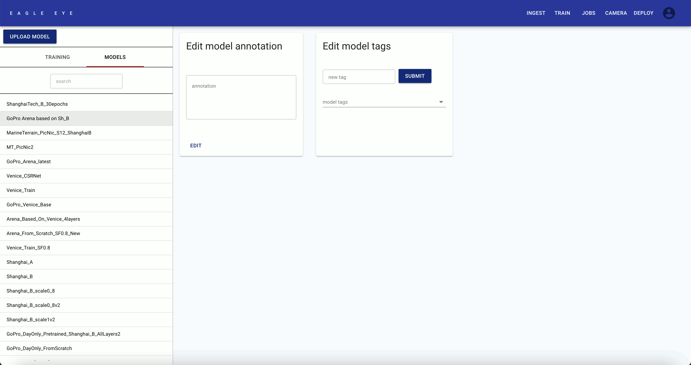

# Train Page
---

### What can be done here?

- [Train a Model](#train-a-model)
- [Review Training Runs](#review-training-runs)
- [Explore Models](#explore-models)

---

## Train a Model 

- Check whether there is a GPU available, by clicking on the **[GPU INFO button].**

  

- Make sure that you have an **annotated dataset** to train on.
  - This dataset should be split into a train and a validation set.

  - You can create and split datasets on the [Ingest Page](../ingest).
  
- Click the **[blue PLUS button]** to create a new training run.

  

- Choose a name for your model. We advise basing it on the used dataset name & camera name.

- For the **Train Script**, pick **train_csrnet.py**.

- Select the **Train Dataset** and **Validation Dataset** which contain data of the scene/situation you want to train your model for.

- When you only have a small amount of training data, you may want to use a pretrained model. To do this, ensure the **Use pretrained model** switch is active. After activating it, you can pick the pretrained model you want to use, and how many of its layers you want to finetune.

- You can modify the json in **Extra arguments** manually in order to change training parameters.

- Finally, click on **TRAIN** to start the training run.

**Example Video:**

<video width="800" height="450" controls>
  <source src="../markdowns/videos/Task 3_3 - Train a Model.mp4" type="video/mp4">
</video>

---

## Review Training Runs 

- To review a training run, select it in the left panel.

---

## Explore Models 

- Go to the [Models](../train/models) subpage.

---

